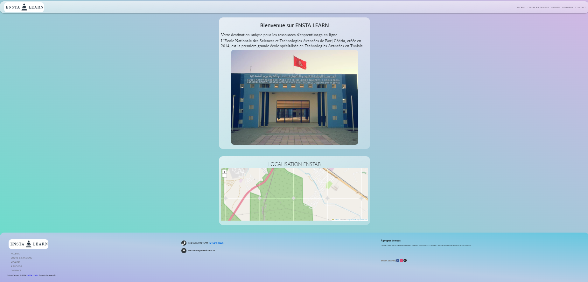

# Welcome to the Enstab Course and Exam Portal

## Project Overview

Welcome to the Enstab Course and Exam Portal, a comprehensive platform designed to facilitate access to courses and exams for students and colleagues at ENSTAB. Our project aims to streamline the process of finding courses and exams, making it easier for users to navigate and locate the resources they need.

## Project Features

- **Course Catalog:** Browse through a vast catalog of courses offered at ENSTAB.
- **Exam Repository:** Access a repository of past exam papers for study and reference purposes.
- **User-Friendly Interface:** Enjoy a user-friendly interface designed for easy navigation and intuitive usage.
- **Responsive Design:** Access the portal seamlessly across various devices, ensuring a smooth user experience.

## Getting Started

To get started with the Enstab Course and Exam Portal, follow these steps:

1. Clone the project repository to your local machine.
2. Install the necessary dependencies using `npm install`.
3. Run the development server with `npm start`.
4. Open [http://localhost:3000](http://localhost:3000) in your web browser to view the portal.

## Project Goals

Our goal with this project is to provide a centralized platform that simplifies the process of accessing courses and exam resources for ENSTAB students and colleagues. By offering a user-friendly interface and comprehensive features, we aim to enhance the learning experience and support academic success.

## About Us

The Enstab Course and Exam Portal project was developed by a dedicated team of students as part of our final year project (PFA2). Our mission is to contribute to the academic community by creating valuable tools and resources that benefit current and future generations of ENSTAB students and faculty.

Thank you for visiting the Enstab Course and Exam Portal. We hope you find it useful and informative!
