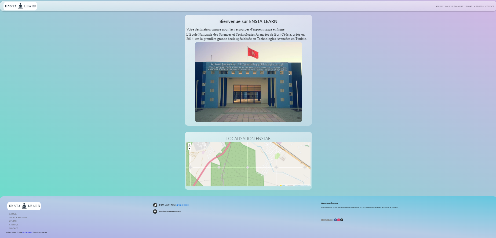

# PFA2024
# Bienvenue sur le Portail des Cours et Examens de l'ENSTAB.

## Project Overview

Bienvenue sur le Portail des Cours et Examens de l'ENSTAB, une plateforme complète conçue pour faciliter l'accès aux cours et examens pour les étudiants et collègues de l'ENSTAB. Notre projet vise à rationaliser le processus de recherche de cours et d'examens, rendant ainsi plus facile la navigation et la localisation des ressources dont les utilisateurs ont besoin.

## Fonctionnalités du Projet
Catalogue de Cours : Parcourez un vaste catalogue de cours proposés à l'ENSTAB.
Répertoire d'Examens : Accédez à un répertoire de sujets d'examens passés pour l'étude et la référence.
Interface Conviviale : Profitez d'une interface conviviale conçue pour une navigation facile et intuitive.
Design Réactif : Accédez au portail de manière transparente sur différents appareils, garantissant une expérience utilisateur fluide.
## Pour Commencer
Pour commencer avec le Portail des Cours et Examens de l'ENSTAB, suivez ces étapes :

Clonez le dépôt du projet sur votre machine locale.
Installez les dépendances nécessaires en utilisant npm install.
Lancez le serveur de développement avec npm start.
Ouvrez http://localhost:3000 dans votre navigateur Web pour afficher le portail.
## Objectifs du Projet
Notre objectif avec ce projet est de fournir une plateforme centralisée qui simplifie le processus d'accès aux cours et ressources d'examen pour les étudiants et collègues de l'ENSTAB. En offrant une interface conviviale et des fonctionnalités complètes, nous visons à améliorer l'expérience d'apprentissage et à soutenir la réussite académique.

## À Propos de Nous
Le projet Portail des Cours et Examens de l'ENSTAB a été développé par une équipe dévouée d'étudiants dans le cadre de notre projet de fin d'année (PFA2). Notre mission est de contribuer à la communauté académique en créant des outils et des ressources précieux qui bénéficient aux générations actuelles et futures d'étudiants et de membres du corps professoral de l'ENSTAB.

Merci d'avoir visité le Portail des Cours et Examens de l'ENSTAB. Nous espérons que vous le trouverez utile et informatif !